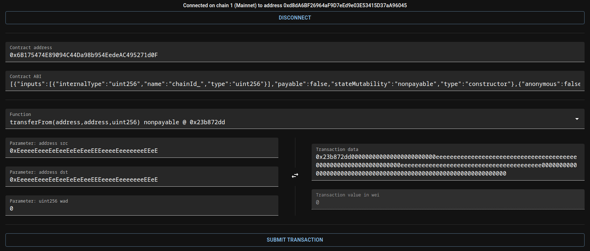

# Transactory

Versatile web-based user interface for encoding and decoding EVM transactions, and submitting them if you're really feeling spicy.



## Features

* Transaction encoding and decoding using a manually provided ABI.
* Ability to input raw transactions in case you lack an ABI.
* Submitting transactions. If an ABI is provided, choosing a view or pure function will allow simulating the transaction to get the return values or error messages.
* Automatically checks if transaction will result in an error before submitting transactions and displays the full error message if they occur.
* Page updates *without refreshing* when the network changes in the wallet.
* Does not use cookies or other forms of local storage. Does not use the Internet at all except to send RPC requests to your chosen EVM node, and even then only when you click the Submit button. The RPC requests will be sent exclusively via calls to `window.ethereum.request()`.
* Compiled JavaScript code does not use any features exclusive to ES6 or later.

## Build instructions

Node.js and npm are required to build this web app. Ensure that they are installed prior to building.

```
npm install    # to install this app's dependencies into node_modules
npm run build  # to compile this app into the build directory
```

After building, the app will become static HTML, CSS and JavaScript and can be served using any web server that can serve static files.
